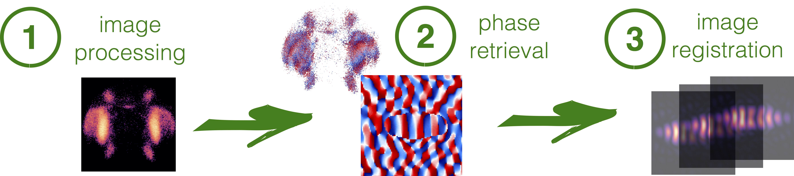

# PhaseRetrieval: framework for solution of the phase problem.

Author: Pavel Kliuiev

PhaseRetrieval is a Python-based framework for solution of the phase problem widely encountered in optics. The framework incorporates the full workflow for phase retrieval: image pre-processing, reconstruction of images by phase retrieval algorithms and post-processing of reconstructed images (such as image registration).



## Requirements

The software was tested using the following versions of the packages:

* ddt 1.3.1  
* numpy 1.15.4
* python 3.6.8
* pandas 0.24.2
* scipy 1.1.0
* scikit-image 0.16.2

## License

GNU General Public License v3.0

## Documentation

Currently there are the following sub-packages available:

   * ```classes```: implementation of classes needed for image processing and phase retrieval
   
   * ```modules```: functions for image registration and visualisation of reconstructed images
   
   * ```scripts```: examples of scripts
   
   * ```tests```  : unit tests
   
For a detailed user guide see [online documentation](https://github.com/pkliui/PhaseRetrieval/blob/master/docs/PhaseRetrieval.md)


```python

```
